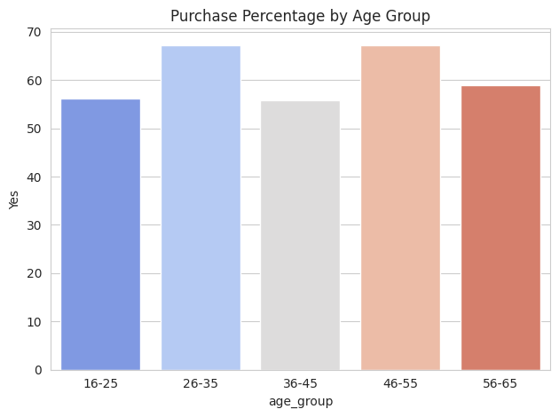
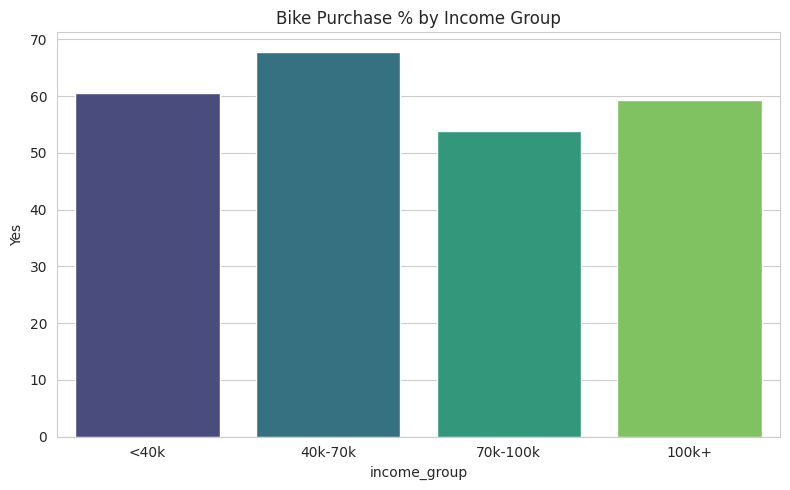

# 🚲 Bike Purchase Analysis – Data Analytics Project

## 🔍 Overview:
In this project, I analyzed a dataset of customers and their likelihood of purchasing bikes. I performed data cleaning, grouping, and trend analysis using Python.

---

## 📦 Tools Used:
- Python (pandas, seaborn, matplotlib)
- Jupyter Notebook
- GitHub

---

## 🧹 Key Steps:
- Cleaned and standardized data (column names, data types)
- Created new columns: Age Group, Income Group
- Analyzed bike purchases across:
  - Age Groups
  - Gender
  - Income Groups

---

## 📊 Key Visualizations:
- **Bike Purchase % by Age Group**
- **Bike Purchase % by Gender**
- **Bike Purchase % by Income Group**

---

## 📈 Insights:
- Customers aged **26–35** and **46–55** are most likely to purchase bikes.
- Both male and female customers show similar buying patterns.
- Higher-income groups (> ₹ 70,000) are more likely to buy bikes.

---

## 📁 Dataset:
Included: `cleaned_bike_sales_data.csv`
## 📊 Visualizations

### 🚲 Bike Purchase % by Age Group

### 💰 Bike Purchase % by Income Group

