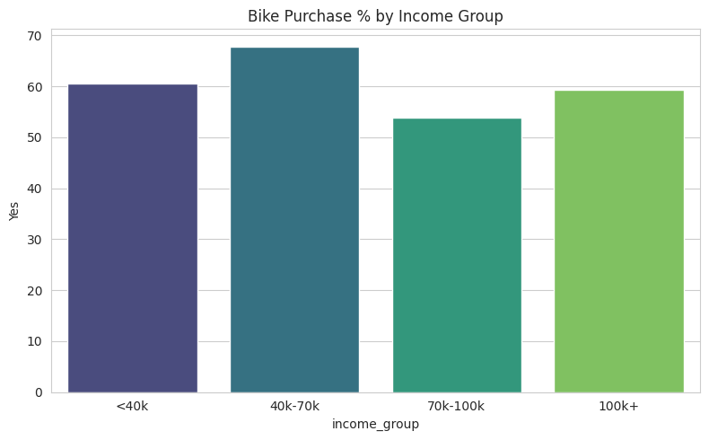

# 🚲 Bike Purchase Analysis – Python (EDA Project)

## 📌 Project Overview
This project analyzes customer demographic data to understand the key factors influencing bike purchasing decisions. Using Python for data cleaning, transformation, and exploratory data analysis (EDA), the objective was to identify high-potential customer segments for targeted marketing strategies.

---

## 🎯 Business Objective
To determine:
- Which age groups are most likely to purchase bikes
- How income level impacts purchasing behavior
- Whether gender influences buying patterns

The insights can help businesses optimize marketing campaigns and customer targeting.

---

## 🛠 Tools & Technologies Used
- Python
- Pandas (data manipulation)
- Matplotlib & Seaborn (visualization)
- Jupyter Notebook
- GitHub

---

## 🧹 Data Preparation & Feature Engineering
- Cleaned and standardized column names
- Handled missing and inconsistent values
- Converted data types for accurate analysis
- Created new features:
  - **Age Group** (16–25, 26–35, 36–45, etc.)
  - **Income Group** (<40K, 40K–70K, etc.)
- Created grouped aggregations for trend analysis

---

## 📊 Key Visualizations

### 🚲 Bike Purchase % by Age Group

### 💰 Bike Purchase % by Income Group

---

## 📈 Key Insights

- Customers aged **26–35** and **46–55** show the highest purchase percentages.
- Middle-income group (40K–70K) demonstrates strong purchasing behavior.
- Higher-income groups (>70K) also maintain steady purchase likelihood.
- Gender-based purchasing patterns show minimal variation.

---

## 💡 Business Recommendations

- Focus targeted promotions on the 26–35 and 46–55 age segments.
- Offer mid-range product bundles for the 40K–70K income segment.
- Develop loyalty programs for high-income customers to increase retention.

---

## 📁 Dataset
- `cleaned_bike_sales_data.csv`

---

## 🚀 Outcome
This analysis highlights key demographic segments driving bike sales and provides actionable insights to improve marketing effectiveness and drive revenue growth.
